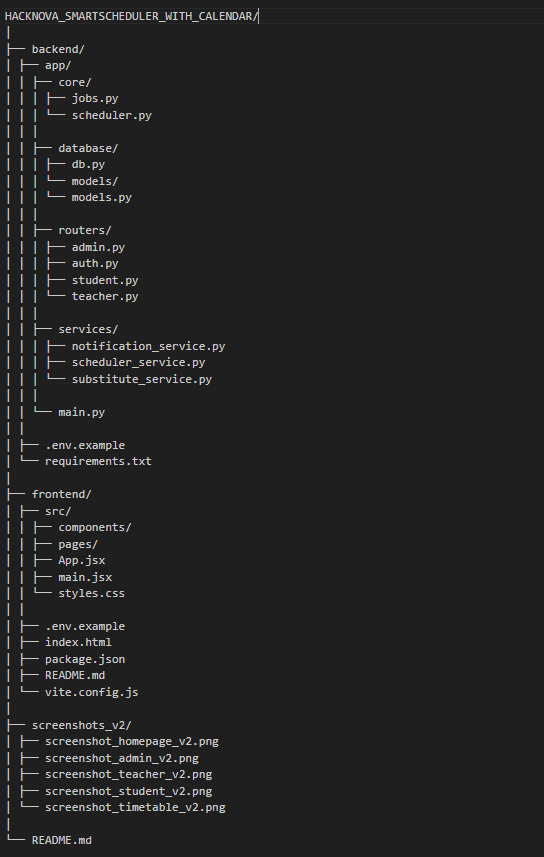
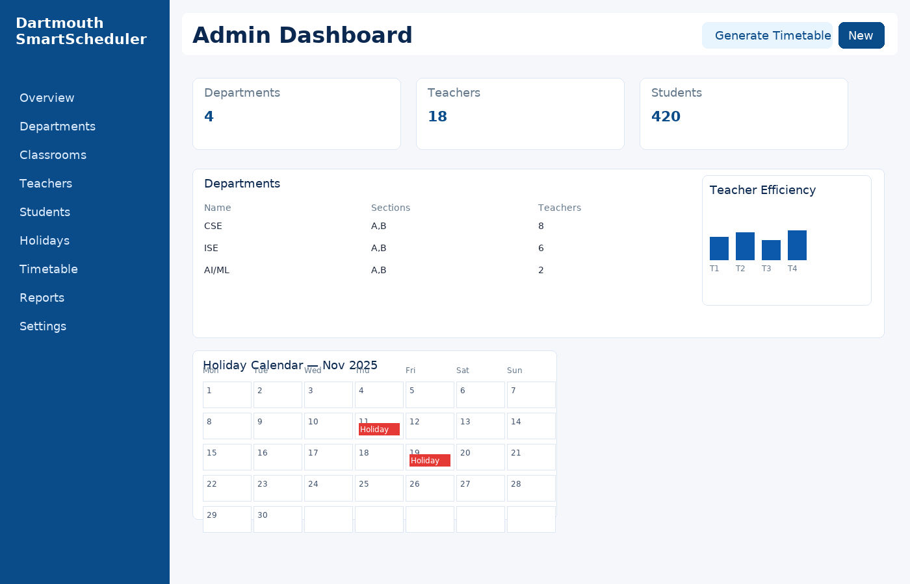
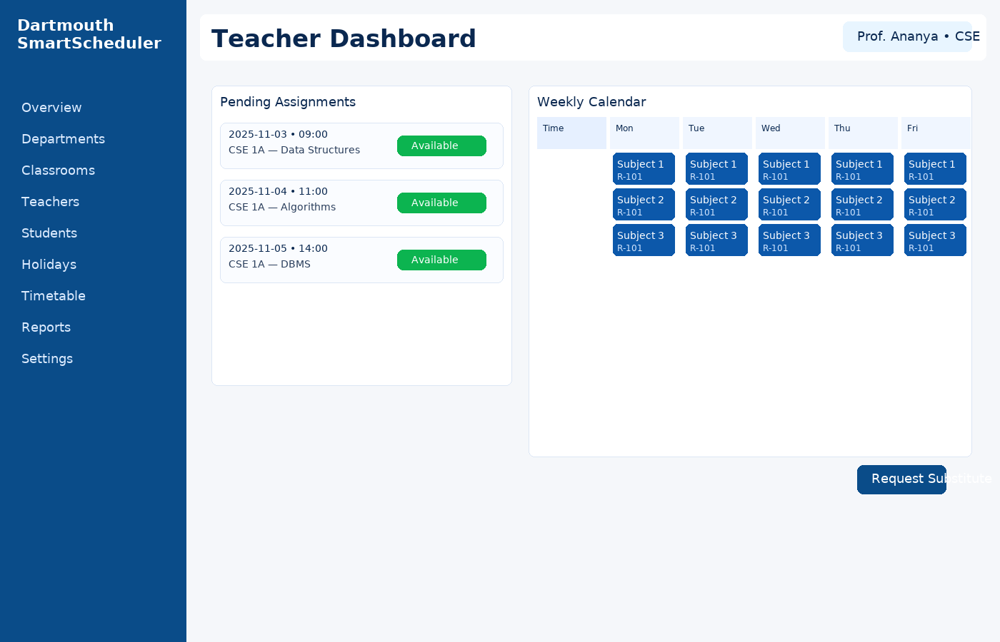
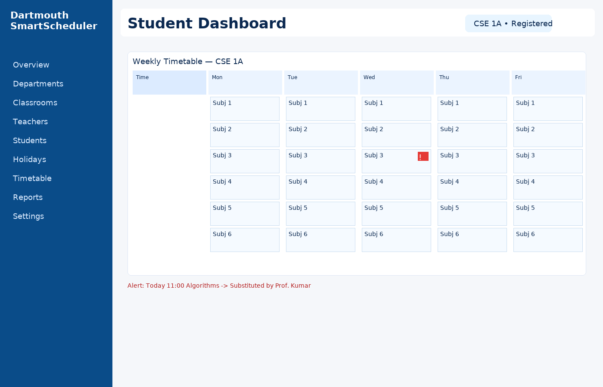
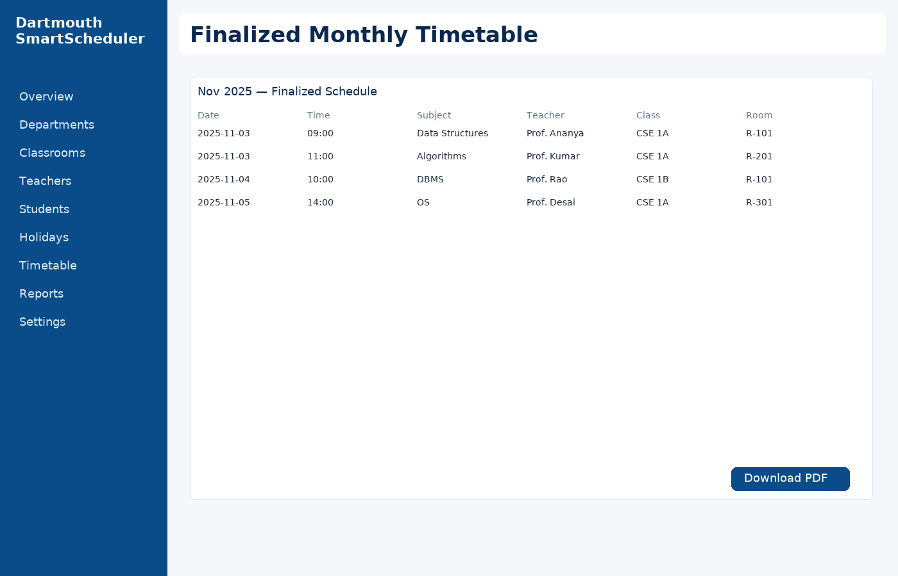

# Dartmouth SmartScheduler

### Smart Timetable & Classroom Management System

---

## 🧩 Description
**Dartmouth SmartScheduler** is an automated timetable and classroom management web application built using **FastAPI (backend)** and **React (frontend)**.  
It dynamically schedules classes, manages substitute teachers, excludes holidays/weekends, and provides analytics with SMS notifications.

---

## 🚀 Problem Solved
Manually creating and maintaining academic timetables is inefficient, especially when teachers are absent or resources are limited.  
This system automates the scheduling process, prevents conflicts, and ensures students and teachers receive real-time updates.

---

## 💡 Proposed Solution
- Intelligent timetable generation that respects all constraints.  
- Dynamic substitution and SMS alerts for real-time schedule changes.  
- Analytics dashboard for administrators.  
- Rich visual dashboards for Admin, Teacher, and Student users.  
- Integration of holidays, resource allocation, and substitute logic.

---

## ⚙️ Core Constraints
- No class scheduling on weekends or declared holidays.  
- Each subject must meet its monthly target.  
- Each classroom can only host one class per slot.  
- Teachers cannot be double-booked.  
- Substitute logic auto-updates only the affected class.  

---


## 🧠 Algorithm Overview

### **1. Timetable Scheduling**
1. Admin inputs departments, subjects, teachers, and resources.  
2. The system uses resource allocation and constraint logic.  
3. Excludes weekends and holiday dates.  
4. Generates an initial timetable and sends to teachers for review.

### **2. Substitution Logic**
1. Teachers mark unavailability → triggers reallocation.  
2. Substitute logic finds available teachers for same subject.  
3. Updated timetable is regenerated only for affected slots.  
4. Students receive SMS: *“Timetable updated – check portal.”*

---
| **Project structure** |  |

---
## 📸 Screenshots
| **Home Page** |  |
| **Admin Dashboard** |  |
| **Teacher Dashboard** |  |
| **Student Dashboard** |  |
| **Finalized Timetable** |  |

---

## 📊 Key Features (Crisp Summary)
- Multi-login (Admin, Teacher, Student)
- Dynamic department, teacher & student management
- AI-based timetable scheduling
- Holiday & weekend exclusion
- Smart substitution logic
- SMS notifications via Twilio
- Teacher analytics dashboard
- Modern React + FastAPI architecture

---

## 🧭 Execution Guide

### **Backend (FastAPI)**
```bash
pip install -r requirements.txt
uvicorn main:app --reload
```

### **Frontend (React)**
```bash
cd frontend
npm install
npm start
```

Access the project at:  
**http://127.0.0.1:8000** (API)  
**http://localhost:3000** (Frontend)

---

## 👏 Credits 
- **Core Project Idea & Logic:** Team Dartmouth  
- **Visualization & Design:** Dartmouth SmartScheduler UI/UX Team  
- **Code Generation:** ChatGPT, Cursor AI, GitHub Copilot
